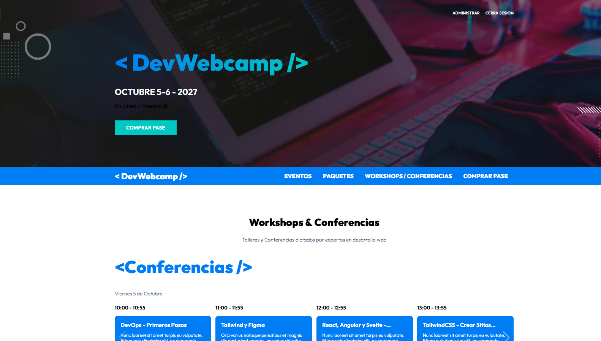
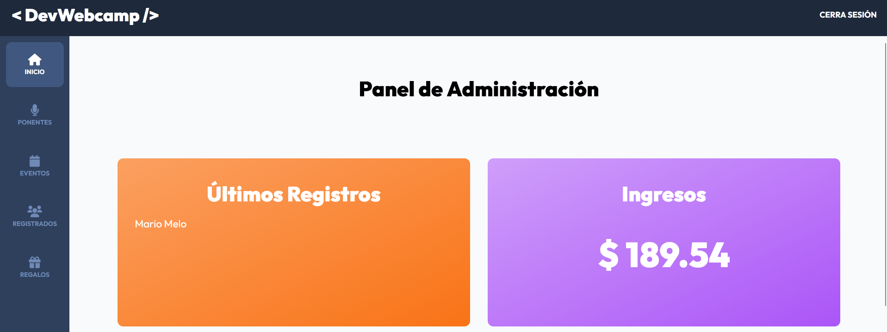
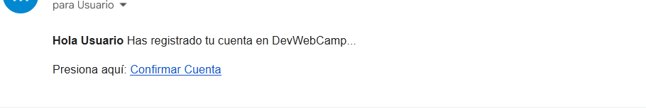
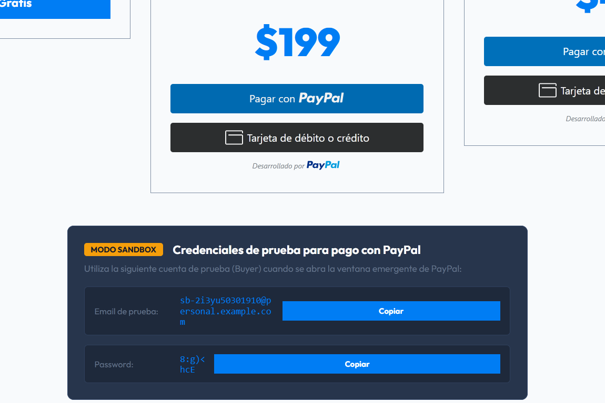
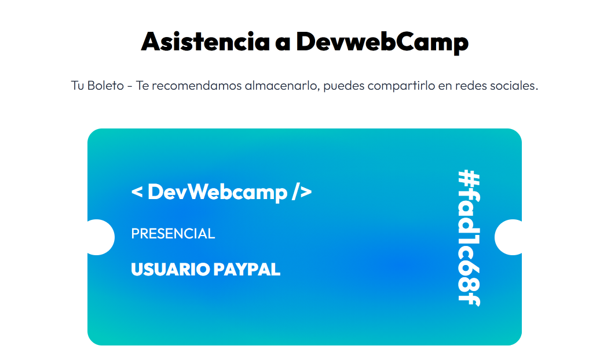

# DevWebCamp

Plataforma web para la gestión y registro de asistentes a DevWebCamp, un evento de desarrollo web. La aplicación permite consultar la información pública del evento, explorar la agenda y los ponentes, completar el registro y administrar el contenido desde un panel privado.

## Tecnologías

- **Frontend:** HTML5, JavaScript, Sass y componentes de interfaz con SweetAlert2 y Swiper.
- **Backend:** PHP 8 con arquitectura MVC, Composer, PHPMailer, PHP Dotenv e Intervention Image.
- **Base de datos:** MySQL mediante `mysqli`.
- **Build:** Gulp para compilar estilos, JavaScript y optimizar imágenes en `public/build`.

## Características

- Página pública del evento, paquetes y conferencias/workshops.
- Registro de usuarios y asistentes, confirmación de cuenta y recuperación de contraseña.
- Flujo de inscripción gratuita o con pago y generación de boleto virtual.
- Consulta de agenda, eventos por horario, ponentes y regalos mediante endpoints JSON.
- Panel administrativo con dashboard y gestión CRUD de ponentes, eventos y regalos.
- Consulta de asistentes registrados.
- Carga y procesamiento de imágenes para los recursos del evento.

## Flujo resumido



### 1. Flujo de Administración

Para evaluar y gestionar el contenido de la plataforma con privilegios de administrador:

1. Dirígete a la sección **Iniciar Sesión** (`/login`).
2. Ingresa las siguientes credenciales:
   - **Email:** `correo@correo.com`
   - **Password:** `654321`
3. Al iniciar sesión, la barra de navegación habilitará el botón exclusivo **Administrar** (`/admin/dashboard`).
4. Desde el panel administrativo podrás gestionar ponentes, eventos, regalos y monitorear los asistentes registrados.



---

### 2. Flujo de Usuario y Pago con PayPal Sandbox

Para simular el registro completo de un asistente y la compra de un boleto:

1. Ve a la sección **Registrarse** (`/registro`) y completa el formulario con un correo real.
2. Abre la bandeja de entrada de tu correo y presiona el enlace del mensaje de verificación para **confirmar la cuenta**.

   

3. Inicia sesión y accede a la sección de **Paquetes / Finalizar Registro** (`/finalizar-registro`).
4. Encontrarás la tabla de planes junto a un bloque con las credenciales de prueba de Sandbox:
   - Copia las credenciales de prueba (**Email de prueba** y **Password**) usando los botones de copiado rápido.
   - En el plan deseado (Pase Presencial o Virtual), haz clic en el botón amarillo oficial de **PayPal** _(no utilices la opción de tarjeta de débito/crédito directa)_.
   - Pega las credenciales de prueba en la ventana emergente de PayPal y confirma la transacción.

   

5. Al capturarse el pago, serás redirigido para seleccionar tus conferencias/talleres y se generará tu **Boleto Virtual** con token y código único de acceso.

   

## Instalación

### Requisitos

- PHP 8 o superior con MySQLi habilitado.
- MySQL 5.7+ o MariaDB.
- Composer.
- Node.js y npm.
- XAMPP, Laragon o un servidor PHP equivalente.

### Pasos

1. Clona el repositorio y entra en la carpeta del proyecto:

   ```bash
   git clone <URL_DEL_REPOSITORIO>
   cd DevWebCamp
   ```

2. Instala las dependencias de PHP y Node.js:

   ```bash
   composer install
   npm install
   ```

3. Crea una base de datos MySQL para el proyecto e importa el esquema y los datos iniciales disponibles en tu entorno.

4. Crea el archivo `.env` en la raíz del proyecto con las credenciales de conexión:

   ```env
   DB_HOST=localhost
   DB_USER=root
   DB_PASS=
   DB_NAME=devwebcamp
   HOST=http://localhost:3000
   EMAIL_HOST=smtp.gmail.com
   EMAIL_PORT=587
   EMAIL_USER=tu_correo@gmail.com
   EMAIL_PASS=tu_clave_de_aplicacion
   PAYPAL_CLIENT_ID=tu_client_id_sandbox
   ```

5. Genera los recursos iniciales de estilos e imágenes:

   ```bash
   npx gulp css
   npx gulp imagenes
   ```

6. Durante el desarrollo, deja Gulp observando cambios y compilando también el JavaScript con:

   ```bash
   npm run dev
   ```

7. Configura el servidor local para apuntar a `public/` como directorio público o ejecuta directamente:
   ```bash
   php -S localhost:3000 -t public
   ```

## Estructura principal

```text
controllers/   Controladores MVC y endpoints de la API
models/        Modelos y acceso a datos
views/         Vistas públicas, de autenticación, registro y administración
classes/       Clases auxiliares
includes/      Bootstrap de la aplicación, funciones y conexión a MySQL
public/        Punto de entrada y recursos públicos compilados
src/           JavaScript, Sass e imágenes fuente
```
